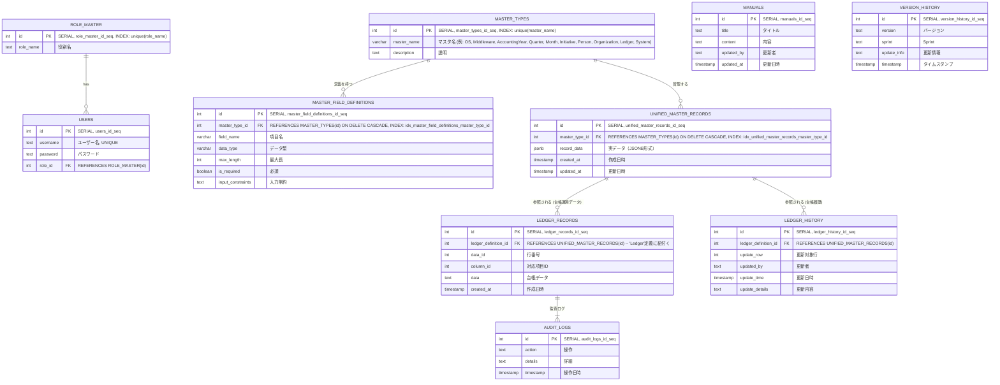

```mermaid
erDiagram
    %% 認証関連
    ROLE_MASTER {
      int id PK "SERIAL, role_master_id_seq, INDEX: unique(role_name)"
      text role_name "役割名"
    }
    USERS {
      int id PK "SERIAL, users_id_seq"
      text username "ユーザー名, UNIQUE"
      text password "パスワード"
      int role_id FK "REFERENCES ROLE_MASTER(id)"
    }
    
    %% 統合マスタ管理
    MASTER_TYPES {
      int id PK "SERIAL, master_types_id_seq, INDEX: unique(master_name)"
      varchar master_name "マスタ名 (例: OS, Middleware, AccountingYear, Quarter, Month, Initiative, Person, Organization, Ledger, System)"
      text description "説明"
    }
    MASTER_FIELD_DEFINITIONS {
      int id PK "SERIAL, master_field_definitions_id_seq"
      int master_type_id FK "REFERENCES MASTER_TYPES(id) ON DELETE CASCADE, INDEX: idx_master_field_definitions_master_type_id"
      varchar field_name "項目名"
      varchar data_type "データ型"
      int max_length "最大長"
      boolean is_required "必須"
      text input_constraints "入力制約"
    }
    UNIFIED_MASTER_RECORDS {
      int id PK "SERIAL, unified_master_records_id_seq"
      int master_type_id FK "REFERENCES MASTER_TYPES(id) ON DELETE CASCADE, INDEX: idx_unified_master_records_master_type_id"
      jsonb record_data "実データ（JSONB形式）"
      timestamp created_at "作成日時"
      timestamp updated_at "更新日時"
    }
    
    %% 台帳トランザクション管理
    LEDGER_RECORDS {
      int id PK "SERIAL, ledger_records_id_seq"
      int ledger_definition_id FK "REFERENCES UNIFIED_MASTER_RECORDS(id) -- 'Ledger'定義に紐付く"
      int data_id "行番号"
      int column_id "対応項目ID"
      text data "台帳データ"
      timestamp created_at "作成日時"
    }
    LEDGER_HISTORY {
      int id PK "SERIAL, ledger_history_id_seq"
      int ledger_definition_id FK "REFERENCES UNIFIED_MASTER_RECORDS(id)"
      int update_row "更新対象行"
      text updated_by "更新者"
      timestamp update_time "更新日時"
      text update_details "更新内容"
    }
    AUDIT_LOGS {
      int id PK "SERIAL, audit_logs_id_seq"
      text action "操作"
      text details "詳細"
      timestamp timestamp "操作日時"
    }
    
    %% その他管理テーブル
    MANUALS {
      int id PK "SERIAL, manuals_id_seq"
      text title "タイトル"
      text content "内容"
      text updated_by "更新者"
      timestamp updated_at "更新日時"
    }
    VERSION_HISTORY {
      int id PK "SERIAL, version_history_id_seq"
      text version "バージョン"
      text sprint "Sprint"
      text update_info "更新情報"
      timestamp timestamp "タイムスタンプ"
    }
    
    %% リレーションシップ
    ROLE_MASTER ||--o{ USERS : "has"
    
    MASTER_TYPES ||--o{ MASTER_FIELD_DEFINITIONS : "定義を持つ"
    MASTER_TYPES ||--o{ UNIFIED_MASTER_RECORDS : "管理する"
    
    %% Ledger定義は統合マスタの一種として、MASTER_TYPES に「Ledger」として登録される
    UNIFIED_MASTER_RECORDS ||--o{ LEDGER_RECORDS : "参照される (台帳運用データ)"
    UNIFIED_MASTER_RECORDS ||--o{ LEDGER_HISTORY : "参照される (台帳履歴)"
    LEDGER_RECORDS ||--|{ AUDIT_LOGS : "監査ログ"
```